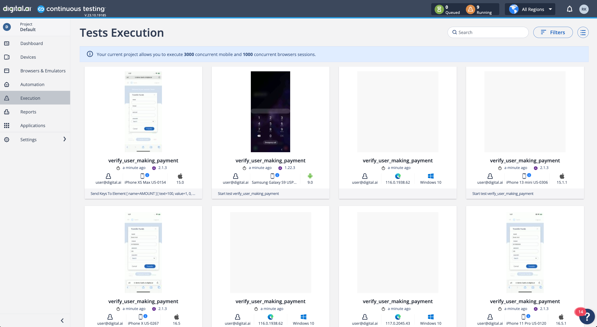

## CT-StoryBoardDemo

### Background

This Framework is designed to run Automated Appium & Selenium Tests against Digital.ai's Continuous Testing [Banking Mobile Application](https://demo-bank.ct.digital.ai/login).

### Technologies Used

```Programming Language```: Java

```Test Automation Framework```: Selenium / Appium

```Compiler Option```: Maven

```Test Runner```: TestNG

### Test Setup

#### Section 1

Provide **Cloud URL** and **Access Key** in ```config.properties``` file.

[Obtaining your Access Key](https://docs.digital.ai/bundle/TE/page/obtaining_access_key.html).

#### Section 2

Make sure Maven is installed from the Execution Machine.

### Test Execution

From your Terminal window or if using CICD, provide as Maven Options, run the following command:

```mvn clean test -DxmlFile=browser_tests.xml,mobile_tests.xml```

This should trigger Automation Tests against the configured Cloud in config.properties:


